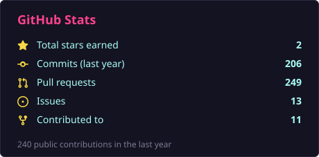
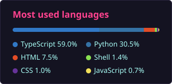
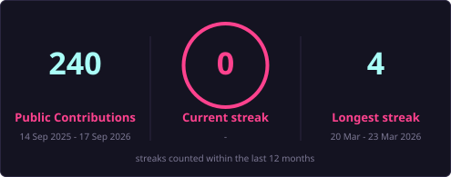
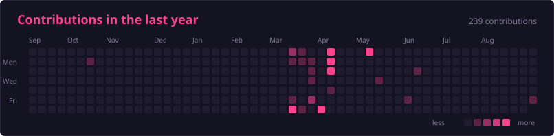

# 👋 Hi, I'm Arthur Maeda (MaedaArthur)

  

## 📊 GitHub at a Glance

  
  

  

  

## 🌐 Connect

  

<!--
Os cards de estatísticas são gerados pelo próprio repositório
(scripts/render_cards.py) e atualizados diariamente pelo workflow
.github/workflows/cards.yml. Não dependem de serviço de terceiros.

O tema sai de CARDS_THEME no workflow: "radical" ou "tokyonight".

Os números cobrem só a atividade pública. Para incluir repositórios privados,
crie um secret CARDS_PAT com um PAT de escopo `repo`.
-->
